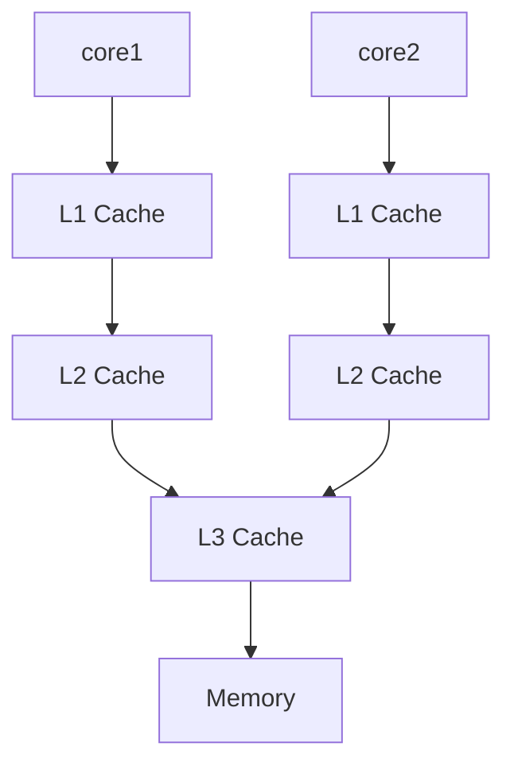
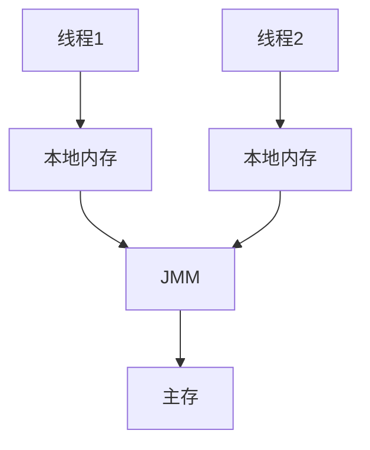

# Java 内存模型

## 1. 计算机内存模型

内存模型(Memory Model) 与计算机硬件、编译器、编程语言、并发相关。但是一旦发生与内存模型相关的问题，总是出现在并发情形下。计算机执行指令时必须讲数据存放在主存中，即物理内存中。随着计算机硬件的发展，CPU执行速度与内存读写速度的差距越来越大，程序的执行效率常常受到内存访问速度的影响，为了协调CPU（执行一个指令大概1ns）与内存（主存访问大概100ns）数量级差异， 在CPU中增加了高速缓存。与计算机存储金字塔结构类似，高速缓存可以按照金字塔结构，从上到下越接近CPU速度越快，容量越小。从上至下依次是L1， L2， L3 cache，每一级的数据都是下一级的一部分。

**当程序运行时，会将需要计算的数据从主存中复制一份到CPU高速缓存中，CPU进行计算时可以直接读写缓存，运算结束后再将数据同步到主存中。**

下图是一个单CPU双核缓存结构：

在CPU和主存之间增加缓存，在并发场景下就可能存在**缓存一致性问题**，在多和cpu中，每一个线程都有自己的缓存，关于同一个数据的缓存内容可能不一致。

### 处理器优化以及指令重排

除了缓存一致性问题，造成线程不安全的原因还有硬件。指令并行重排序，同时执行的指令有多条，如果CPU认为指令不具有相关性，可以并行执行，代码顺序进一步被打乱；编译器会调整某些代码的执行顺序，进行指令重排，从而提高运行效率。如果任由处理器以及编译器进行指令重排，在多线程场景中会导致各种问题。

### 线程安全的特性

在拥有共享数据的多个线程并行执行的过程中，线程安全的代码会通过同步机制，保证每一个线程都正常且正确的执行，不会出现数据污染的情况。需要满足以下特性：

+ **原子性**： 一个操作中cpu的执行不可被中断
+ **可见性**：多个线程访问同一个变量时，一个线程对于数据的修改其他线程立即可见
+ **有序性**：程序的执行顺序可以按照代码顺序

解决并发问题，主要有两个方法：

+ **限制编译器优化**：对于一些共享数据，禁止编译器对于包含这些语句的重排序优化，至于不需要的同步的变量的语句，尽可能进行优化。比较有名的是`happens-before`规则
+ **内存屏障**： 限制流水线指令并行优化，讲缓存结果同步到内存，典型应用就是锁，例如Java中的`synchorized` 

## 2. Java 内存模型

Java线程间通信通过共享内存实现。JMM（Java Memory Model）是一种符合内存模型规范，屏蔽各种硬件以及操作系统访问差异,保证Java程序在各平台下对内存的访问都能保证效果一致的机制和规范。

Java内存模型规定了所有变量都存储在主存中，每条线程都有自己的工作内存，线程的工作内存保存了该线程工作所需要的数据的全部主内存副本拷贝。线程对于所有变量的操作必须在工作内存中进行，不直接进行主存读写。不同线程无法访问其他线程的工作内存，线程间变量传递必须通过主存与工作内存的数据同步。**JMM作用于工作内存以及主存之间，规定了如何做数据同步，以及何时做数据同步**

主内存、工作内存与JVM中的堆、栈、方法区不是同一个层次的内存划分，无法直接类比。主内存、工作内存的概念可以简单类比为计算机内存模型的主存以及高速缓存。

### Java内存模型的实现

Java提供了一系列处理并发的关键字: `final`, `volatile`, `sychronized`, 以及`concurrent`包。进行开发时可以使用这些关键字保证三个特性：

+ **原子性**： `sychornized` 关键字使用两个高级字节码`monitorenter`, `moniterexit` 使用加锁的方式保证原子性。由于某个时刻仅有一个线程进行数据操作，相当于顺序执行代码，自然可以保证有序性。
+ **可见性**：Java内存模型在变量修改后讲新的数值同步到主存，变量读取前从主存刷新数据。`volatile` 关键字修饰的变量被修改后可以立即同步到主存，并且每次使用之前都需要从主存刷新数据。`synchorized`, `final`也可以保证可见性
+ **有序性**： 可以使用`synchorized`, `volatile` 关键字实现有序性，`volatile`会禁止指令重排，`synchorized`保证同一时刻仅有一个线程进行数据操作。

`synchorized` 可以同时保证以上三个特性，但是会导致性能问题

### 3. `synchroized` 关键字

`sychorized` 关键字可以用于修饰方法、代码块，当需要保证一个共享资源在同一时间只被一个线程访问时，可以使用`synchorized`对类或者对象加锁。**对于同步方法，JVM采用 `ACC_synchorized` 标记符实现同步；对于同步代码块，使用`monitorenter`, `monitorexit` 两个指令实现**

+ **ACC_SYCHROIZED**: 方法级的同步是隐式的，同步方法的常量池中有一个`ACC_synchroized` 标志，如果线程访问带有该标志的方法，需要先获取监视器锁，然后开始执行，方法执行结束后释放监视器锁。如果方法执行过程中跑出了异常，方法内部不处理该异常，在异常抛到方法外之前，监视器锁也会被释放。
+ 同步代码块使用`monitorexter`, `monitorexit` 两个指令。每一个对象维护一个记录加锁次数的计数器，初始值为0。当一个线程执行monitorenter获得锁之后，计数器加1，同一个线程再次获得锁继续加1，释放锁时减1。直到计数器为0，其他线程可以获得锁。

`synchronized` 如何保证线程安全三个特性：

+ 原子性： 线程是cpu调度的基本单位，CPU有时间片的概念，根据不同的线程调度算法进行线程调度。当线程获得一个时间片之后开始执行，时间片耗尽之后失去CPU使用权。由于时间片在多线程间轮换，就会产生原子性问题。当一个线程A执行monitorenter加锁后，其他线程无法获得锁，CPU时间片执行结束，其他线程依然无法获得montor锁。由于synchorized锁是可重入的，·下一个时间片只能被持有锁的线程获得。**线程的中断操作对于正在等待获取锁对象的`synchronized`方法或者代码块并不起作用，也就是对于`synchronized` 来说，如果一个线程正在等待锁，那么结果只有两种，要么获得锁继续执行，要么继续等待，调用中断线程的方法也不会生效。**
+ 可见性：synchorized不限制处理器优化以及指令重排，通过加锁保证临界区资源安全，同事对于一个变量解锁前会确保该变量已经同步到主存。
+ 有序性： 单线程操作天然有序

### 4. `volatile` 关键字

`volatile` 通常被视作轻量级的`synchronized` ，只能用于修饰变量，不可用于修饰方法以及代码块。可以保证并发环境下的可见性以及有序性。保证各个线程的工作内存的变量时一致的，实现了缓存一致性协议。

被`volatile` 修饰的变量，进行写操作时，JVM会向处理器发送一条lock前缀的指令，将这个数据缓存写入到主存中。每一个处理器通过嗅探在总线上传播的数据检查自己的缓存是否过期，当处理器发现缓存对应的内存地址被修改时，就会立即将处理器的缓存设置为无效状态，当处理器需要对该数据进行操作时强制从主存读取最新的数据。

**所以一个变量被`volatile` 修饰后，每次数据变化，其值都会被强制刷入主存。二其他处理器由于遵守了缓存一致性协议，也会把变量的值从主存中加载到各自缓存，保证了可见性。**

同时，`volatile` 变量涉及的语句会禁止指令重排优化，保证程序严格按照代码先后顺序执行。但是不能保证原子性。

以下情形可以用volatile替换synchronized：

+ 运算结果不依赖变量的当前值，或者确保只有单一线程会改变当前值
+ 变量不需要与其他变量共同参数不变性约束

### 5. `sychronized` 与 `volatile` 关系

sychronized缺陷：

+ 性能损耗： 虚拟机对于锁进行了许多消除以及优化，很难量化两者之间的差距，但是可以确定的一个原则是volatile读操作的性能消耗与普通变量几乎没有区别，写操作的由于要插入内存屏障所以会慢一些，volatile在大多数场景下比锁要快一点
+ 产生阻塞：无论是同步方法还是同步代码块，都是基于monitor实现的。sychronized实现的锁本质是一种阻塞锁。
+ volatile附加功能：禁止处理器优化以及指令重排