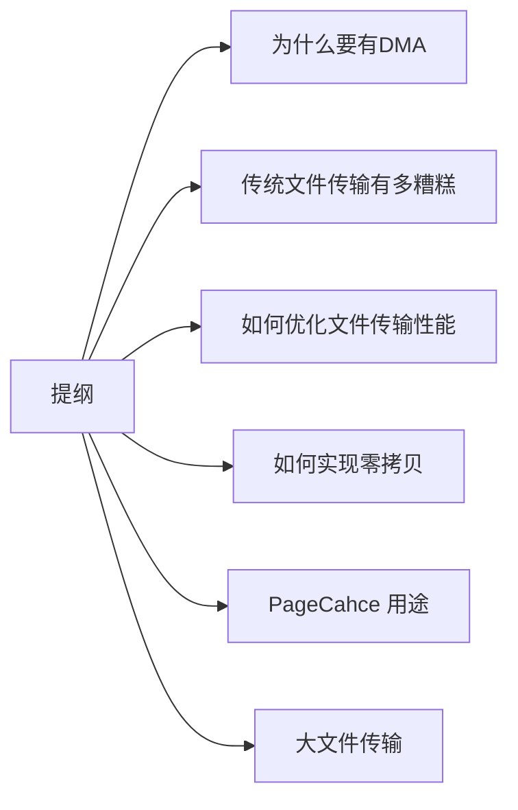

# 文件读写与零拷贝

磁盘可以说是计算机系统最慢的硬件之一，读写速度相差内存 10 倍以上，所以针对优化磁盘的技术非常的多，比如零拷贝、直接 I/O、异步 I/O 等等，这些优化的目的就是为了提高系统的吞吐量，另外操作系统内核中的磁盘高速缓存区，可以有效的减少磁盘的访问次数。



## 1. 为什么使用DMA

### 1.1 没有DMA时的IO

+ CPU 发送读指令给磁盘控制器，然后返回；
+ 磁盘控制器接收到指令后，把数据读取到磁盘控制器的内部缓冲区，然后产生一个**中断**；
+ CPU 接收到中断信号，停下当前任务，把磁盘缓冲区的数据按字节拷贝到寄存器，再由寄存器拷贝到内存。

对应的`read()`系统调用流程:


整个数据传输过程，都需要CPU进行数据拷贝，期间CPU不能处理其他任务，对于传输大数据量时，会消耗大量的CPU资源。

### 1.2 DMA

DMA (Directly Memory Access) 本质上是一个在主板上用于主存与IO设备进行数据传输的独立芯片。进行数据传输时，不再通过CPU进行控制，直接由DMA控制器 (DMA Controller, 简称DMAC)控制。这块芯片可以认为是一个协处理器**(Co-processor)**.

DMAC 的价值在如下情况中尤其明显：当我们要传输的数据特别大、速度特别快，或者传输的数据特别小、速度特别慢的时候。

*注意：这里面的“协”字。DMAC 是在“协助”CPU，完成对应的数据传输工作。在 DMAC 控制数据传输的过程中，DMAC 还是被 CPU 控制，只是数据的拷贝行为不再由 CPU 来完成。*

使用DMA进行数据传输的流程如下：


+ 用户调用`read`方法，向操作系统发出IO请求，请求读取数据到自己的内存缓冲区，进程进入阻塞状态；
+ `read()` 系统调用陷入内核，内核将IO请求发送给DMA，cpu之后可以执行其他任务
+ DMA 将请求发送给磁盘控制器；
+ 磁盘收到DMA 的IO请求，把数据从磁盘读取到磁盘缓冲区，读满之后向DMA发送中断信号，通知DMAC
+ **DMAC 收到磁盘控制器中断，将磁盘缓冲区数据读取到内核缓冲区，不需要CPU参与**；
+ 当DMA读取了全部数据，向CPU发送中断信号；
+ CPU收到中断信号，将数据从内核缓冲区拷贝到用户缓冲区。系统调用返回。

## 2. 传统数据传输有多糟糕

如果服务端要提供文件传输的功能，我们能想到的最简单的方式是：将磁盘上的文件读取出来，然后通过网络协议发送给客户端。

传统 I/O 的工作方式是，数据读取和写入是从用户空间到内核空间来回复制，而内核空间的数据是通过操作系统层面的 I/O 接口从磁盘读取或写入。

代码通常如下，一般会需要两个系统调用：

```c
read(file, tmp_buf, len);
write(socket, tmp_buf, len);
```

代码很简单，虽然就两行代码，但是这里面发生了不少的事情。


首先这两个操作进行了2次系统调用，涉及4次上下文切换，每一次系统调用都需要从用户态切换到内核态，等到内核态完成操作后再返回用户态。一次上下文切换耗时**几十纳秒到几微妙**，在高并发场景下，上下文切换的时间会被累计和放大，从而影响系统性能。

同时进行了4次数据拷贝，其中两次DMA拷贝，另外两次cpu进行拷贝：

+ **第一次拷贝**，把磁盘上的数据拷贝到操作系统内核的缓冲区里，这个拷贝的过程是通过 DMA 搬运的。
+ **第二次拷贝**，把内核缓冲区的数据拷贝到用户的缓冲区里，于是我们应用程序就可以使用这部分数据了，这个拷贝到过程是由 CPU 完成的。
+ **第三次拷贝**，把刚才拷贝到用户的缓冲区里的数据，再拷贝到内核的 socket 的缓冲区里，这个过程依然还是由 CPU 搬运的。
+ **第四次拷贝**，把内核的 socket 缓冲区里的数据，拷贝到网卡的缓冲区里，这个过程又是由 DMA 搬运的。

## 3. 如何优化文件传输的性能

> **如何减少 【用户态以及内核态的上下文切换次数】 ？**

读取磁盘数据的时候，之所以要发生上下文切换，这是因为用户空间没有权限操作磁盘或网卡，内核的权限最高，这些操作设备的过程都需要交由操作系统内核来完成，所以一般要通过内核去完成某些任务的时候，就需要使用操作系统提供的系统调用函数。

想要减少上下文切换次数，就要减少系统调用次数。

>**如何减少数据 【拷贝次数】？**

以上4次数据拷贝过程中，从内核态拷贝到用户态，再从用户态拷贝到socket缓冲区这一过程时非必要的。**因为文件传输过程中，我们不需要对文件进行 「再加工」，所以不需要搬运到用户空间。**

同时，也不每必要将数据从内核态拷贝到socket缓冲区，二者可以使用同一个缓冲区。

## 4. 如何实现零拷贝？

通常有两种方式：

+ mmap + write
+ sendfile

### 4.1 mmap + write

`read` 系统调用会把数据从内和缓冲区拷贝到用户缓冲区，这一步可以省略。`mmap`系统调用会把内核缓冲区的数据直接映射到用户缓冲区，然后再使用`write` 系统调用，直接读取对应内存，将数据拷贝到socket缓冲区：


+ 应用进程调用了 mmap() 后，DMA 会把磁盘的数据拷贝到内核的缓冲区里。接着，应用进程跟操作系统内核「共享」这个缓冲区；
+ 应用进程再调用 write()，操作系统直接将内核缓冲区的数据拷贝到 socket 缓冲区中，这一切都发生在内核态，由 CPU 来搬运数据；
+ 最后，把内核的 socket 缓冲区里的数据，拷贝到网卡的缓冲区里，这个过程是由 DMA 搬运的。 

这种方式仅减少了一次数据拷贝。

### 4.2 sendfile

在 Linux 内核版本 2.1 中，提供了一个专门发送文件的系统调用函数 sendfile()，函数形式如下：

```c
#include <sys/socket.h>
ssize_t sendfile(int out_fd, int in_fd, off_t *offset, size_t count);
```

它的前两个参数分别是目的端和源端的文件描述符，后面两个参数是源端的偏移量和复制数据的长度，返回值是实际复制数据的长度。

首先，它可以替代前面的 read() 和 write() 这两个系统调用，这样就可以减少一次系统调用，也就减少了 2 次上下文切换的开销。

其次，该系统调用，可以直接把内核缓冲区里的数据拷贝到 socket 缓冲区里，不再拷贝到用户态，这样就只有 2 次上下文切换，和 3 次数据拷贝。如下图：


但是这还不是真正的零拷贝技术，如果网卡支持 SG-DMA（The Scatter-Gather Direct Memory Access）技术（和普通的 DMA 有所不同），我们可以进一步减少通过 CPU 把内核缓冲区里的数据拷贝到 socket 缓冲区的过程。

你可以在你的 Linux 系统通过下面这个命令，查看网卡是否支持 scatter-gather 特性：

```shell
$ ethtool -k eth0 | grep scatter-gather
scatter-gather: on
```

于是，从 Linux 内核 2.4 版本开始起，对于支持网卡支持 SG-DMA 技术的情况下， sendfile() 系统调用的过程发生了点变化，具体过程如下：

+ 第一步，通过 DMA 将磁盘上的数据拷贝到内核缓冲区里；
+ 第二步，缓冲区描述符和数据长度传到 socket 缓冲区，这样网卡的 SG-DMA 控制器就可以直接将内核缓存中的数据拷贝到网卡的缓冲区里，此过程不需要将数据从操作系统内核缓冲区拷贝到 socket 缓冲区中，这样就减少了一次数据拷贝；


这就是所谓的零拷贝技术，因为没有从内存层面拷贝数据，也就是没有通过CPU进行数据拷贝，所有的数据都是通过DMA传输的。

**零拷贝技术与传统的文件传输方式相比，减少了2次上下文切换以及数据拷贝的过程** 。所以，总体来看，零拷贝技术可以把文件传输的性能提高至少一倍以上。

## 5. PageCache 

前面介绍的文件传输过程，第一步都是需要把磁盘文件拷贝到内核缓冲区，这个内核缓冲区实际上是磁盘高速缓存PageCahe。

由于零拷贝使用了PageCache技术，可以进一步提高零拷贝性能。读写磁盘速度远低于读写内存（内存随机读取500ns，磁盘寻址时间2ms），为了提高读写性能，应该尽可能把磁盘数据放在内存中。可以通过DMA把磁盘中的数据搬运到内存里，这样可以读内存替代读磁盘。但是内存空间远小于磁盘空间，只能缓存部分数据。

这里充分利用了数据访问的局部性原理，通常情况下，刚被访问的数据及其附近数据被访问的概率较高。**PageCache用于缓存最近访问的数据**，空间不足时淘汰最久未被访问的缓存。

所以进行读写时，优先操作PageCache，如果找不到数据，再操作磁盘，并且缓存相应数据。

同时，进行磁盘读写时，需要找到数据所在位置，但是磁头寻址操作极为耗时。为了降低其影响，**PageCache开启了预读功能**。即读取目标数据以及后续数据作为缓存。

PageCache两个特点：

+ 缓存最近访问的数据
+ 数据预读

这两个做法将大大提高磁盘读写性能。

### 5.1 大文件不适用

**但是在读写大文件时（GB），PageCache会不起作用，会白白浪费DMA多做一次数据拷，降低性能，即使使用了PageCahce的零拷贝也会损失性能**。

这是因为如果你有很多 GB 级别文件需要传输，每当用户访问这些大文件的时候，内核就会把它们载入 PageCache 中，于是 PageCache 空间很快被这些大文件占满。

另外，由于文件太大，可能某些部分的文件数据被再次访问的概率比较低，这样就会带来 2 个问题：

+ PageCache 由于长时间被大文件占据，其他「热点」的小文件可能就无法充分使用到 PageCache，于是这样磁盘读写的性能就会下降了；
+ PageCache 中的大文件数据，由于没有享受到缓存带来的好处，但却耗费 DMA 多拷贝到 PageCache 一次；

所以，针对大文件的传输，不应该使用 PageCache，也就是说不应该使用零拷贝技术，因为可能由于 PageCache 被大文件占据，而导致「热点」小文件无法利用到 PageCache，这样在高并发的环境下，会带来严重的性能问题。

## 6. 大文件传输

读取大文件时，用户进程发起`read()`调用，整个过程是阻塞的：

+ 当调用 read 方法时，会阻塞着，此时内核会向磁盘发起 I/O 请求，磁盘收到请求后，便会寻址
+ 当磁盘数据准备好后，就会向内核发起 I/O 中断，告知内核磁盘数据已经准备好；
+ 内核收到 I/O 中断后，就将数据从磁盘控制器缓冲区拷贝到 PageCache 里；
  最后，内核再把 PageCache 中的数据拷贝到用户缓冲区，于是 read 调用就正常返回了。

可以使用异步IO加以改进：


将读取操作分为两步：

+ 前半部分，内核向磁盘发起读请求，但是可以不等待数据就位就可以返回，于是进程此时可以处理其他任务；
+ 后半部分，当内核将磁盘中的数据拷贝到进程缓冲区后，进程将接收到内核的通知，再去处理数据；

而且，我们可以发现，异步 I/O 并没有涉及到 PageCache，所以使用异步 I/O 就意味着要绕开 PageCache。

绕开 PageCache 的 I/O 叫直接 I/O，使用 PageCache 的 I/O 则叫缓存 I/O。通常，对于磁盘，异步 I/O 只支持直接 I/O。

前面也提到，大文件的传输不应该使用 PageCache，因为可能由于 PageCache 被大文件占据，而导致「热点」小文件无法利用到 PageCache。

于是，在高并发的场景下，针对大文件的传输的方式，应该使用「异步 I/O + 直接 I/O」来替代零拷贝技术。

### 6.1 直接IO

直接 I/O 应用场景常见的两种：

+ 应用程序已经实现了磁盘数据的缓存，那么可以不需要 PageCache 再次缓存，减少额外的性能损耗。在 MySQL 数据库中，可以通过参数设置开启直接 I/O，默认是不开启；
+ 传输大文件的时候，由于大文件难以命中 PageCache 缓存，而且会占满 PageCache 导致「热点」文件无法充分利用缓存，从而增大了性能开销，因此，这时应该使用直接 I/O。

另外，由于直接 I/O 绕过了 PageCache，就无法享受内核的这两点的优化：

+ 内核的 I/O 调度算法会缓存尽可能多的 I/O 请求在 PageCache 中，最后「合并」成一个更大的 I/O 请求再发给磁盘，这样做是为了减少磁盘的寻址操作；
+ 内核也会「预读」后续的 I/O 请求放在 PageCache 中，一样是为了减少对磁盘的操作；

## 7. 总结

早期 I/O 操作，内存与磁盘的数据传输的工作都是由 CPU 完成的，而此时 CPU 不能执行其他任务，会特别浪费 CPU 资源。

于是，为了解决这一问题，DMA 技术就出现了，每个 I/O 设备都有自己的 DMA 控制器，通过这个 DMA 控制器，CPU 只需要告诉 DMA 控制器，我们要传输什么数据，从哪里来，到哪里去，就可以放心离开了。后续的实际数据传输工作，都会由 DMA 控制器来完成，CPU 不需要参与数据传输的工作。

传统 IO 的工作方式，从硬盘读取数据，然后再通过网卡向外发送，我们需要进行 4 上下文切换，和 4 次数据拷贝，其中 2 次数据拷贝发生在内存里的缓冲区和对应的硬件设备之间，这个是由 DMA 完成，另外 2 次则发生在内核态和用户态之间，这个数据搬移工作是由 CPU 完成的。

为了提高文件传输的性能，于是就出现了零拷贝技术，它通过一次系统调用（sendfile 方法）合并了磁盘读取与网络发送两个操作，降低了上下文切换次数。另外，拷贝数据都是发生在内核中的，天然就降低了数据拷贝的次数。

Kafka 和 Nginx 都有实现零拷贝技术，这将大大提高文件传输的性能。

零拷贝技术是基于 PageCache 的，PageCache 会缓存最近访问的数据，提升了访问缓存数据的性能，同时，为了解决机械硬盘寻址慢的问题，它还协助 I/O 调度算法实现了 IO 合并与预读，这也是顺序读比随机读性能好的原因。这些优势，进一步提升了零拷贝的性能。

需要注意的是，零拷贝技术是不允许进程对文件内容作进一步的加工的，比如压缩数据再发送。

另外，当传输大文件时，不能使用零拷贝，因为可能由于 PageCache 被大文件占据，而导致「热点」小文件无法利用到 PageCache，并且大文件的缓存命中率不高，这时就需要使用「异步 IO + 直接 IO 」的方式。

在 Nginx 里，可以通过配置，设定一个文件大小阈值，针对大文件使用异步 IO 和直接 IO，而对小文件使用零拷贝。