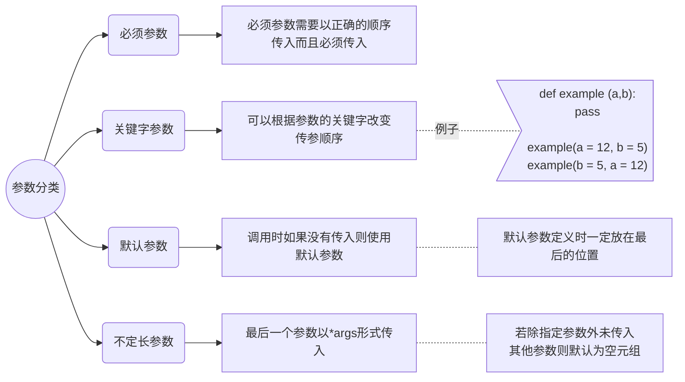
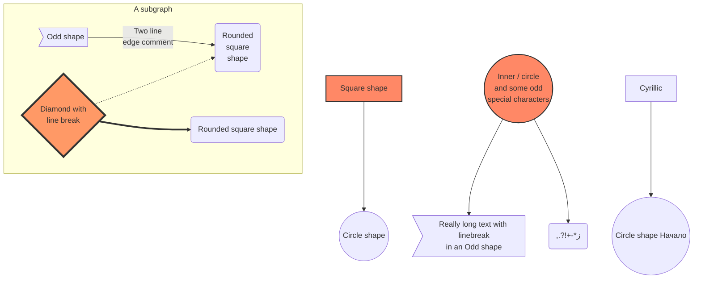

```mermaid
graph LR

	SVN((参数分类)) --> a(必须参数)
	SVN((参数分类)) --> b(关键字参数)
   	SVN --> c(默认参数)
   	SVN --> d(不定长参数)

   	
   	a --> e[必须参数需要以正确的顺序传入而且必须传入]
    b --> f[可以根据参数的关键字改变传参顺序]
    f -.-|例子| g>"def example (a,b):<br/>pass<br/><br/>example(a  = 12, b = 5)<br/> example(b = 5, a = 12)"]
    c --> h[调用时如果没有传入则使用默认参数]
    h -.- 默认参数定义时一定放在最后的位置
    d --> i["最后一个参数以*args形式传入"]
    i -.- ds["若除指定参数外未传入<br/>其他参数则默认为空元组"]
    
    
```

```mermaid
graph TB
    sq[Square shape] --> ci((Circle shape))

    subgraph A subgraph
        od>Odd shape]-- Two line<br/>edge comment --> ro
        di{Diamond with <br/> line break} -.-> ro(Rounded<br>square<br>shape)
        di==>ro2(Rounded square shape)
    end

    %% Notice that no text in shape are added here instead that is appended further down
    e --> od3>Really long text with linebreak<br>in an Odd shape]

    %% Comments after double percent signs
    e((Inner / circle<br>and some odd <br>special characters)) --> f(,.?!+-*ز)

    cyr[Cyrillic]-->cyr2((Circle shape Начало));

     classDef green fill:#F86,stroke:#333,stroke-width:2px;
     classDef orange fill:#f96,stroke:#333,stroke-width:4px;
     class sq,e green
     class di orange

```