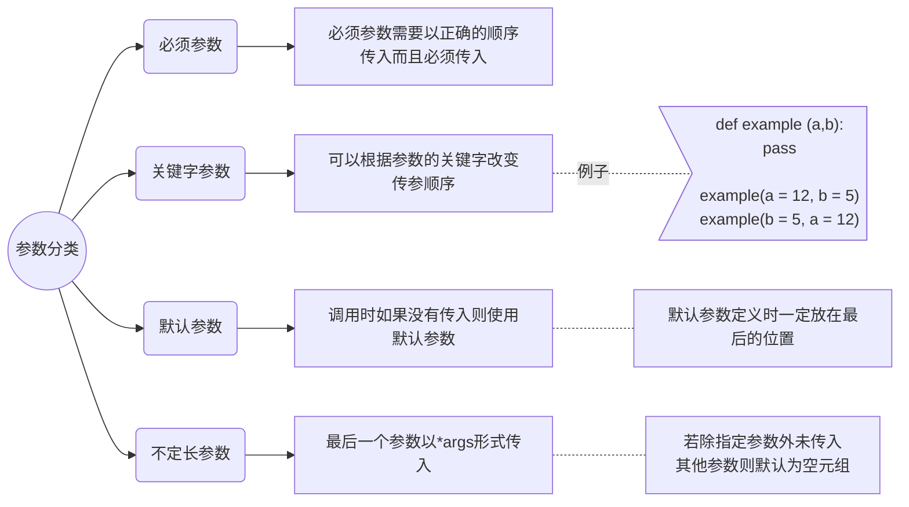

# Python3 函数解析

[TOC]

## :battery: 函数的定义与调用

> + 函数块以关键字`def`开头，以 `return` 结束返回相应的值，若为空则返回`None`
> + 参数放在圆括号中，函数内容以冒号起始，注意缩进
> + 函数说明通常放在函数名前一行
> + 函数调用时直接按名称调用
>
>

## :battery: 参数的传递

python是面向对象的语言，只有对象具有类型而变量不具有类型，函数的参数类型与变量无关只与实际调用时的对象有关

在 python 中，strings, tuples, 和 numbers 是不可更改的对象，而 list,dict 等则是可以修改的对象

### 1. 对象类型
>+  **不可变类型：** 变量赋值 `a=5 `后再赋值 `a=10`，这里实际是新生成一个` int` 值对象 `10`，再让 a 指向它，而 5 被丢弃，不是改变a的值，相当于新生成了a。
>
>  类似 c++ 的值传递，如 整数、字符串、元组。如fun（a），传递的只是a的值，没有影响a对象本身。比如在 fun（a）内部修改 a 的值，只是修改另一个复制的对象，不会影响 a 本身。
>
>  ​
>
>+ **可变类型：**变量赋值 **la=[1,2,3,4]** 后再赋值 **la[2]=5** 则是将 list la 的第三个元素值更改，本身la没有动，只是其内部的一部分值被修改了
>
>  类似 c++ 的引用传递，如 列表，字典。如 fun（la），则是将 la 真正的传过去，修改后fun外部的la也会受影响


### 2.参数分类


**Attention：**

:mag_right: 必须参数是必不可少的，默认参数和不定长参数在函数定义时必须放在后面

:mag_right: 使用关键字参数允许函数调用时参数顺序与定义时不同


### 3.匿名函数

python 使用 lambda 来创建匿名函数。

所谓匿名，意即不再使用 def 语句这样标准的形式定义一个函数。

> + lambda 只是一个表达式，函数体比 def 简单很多。
> + lambda的主体是一个表达式，而不是一个代码块。仅仅能在lambda表达式中封装有限的逻辑进去。
> + lambda 函数拥有自己的命名空间，且不能访问自己参数列表之外或全局命名空间里的参数。
> + 虽然lambda函数看起来只能写一行，却不等同于C或C++的内联函数，后者的目的是调用小函数时不占用栈内存从而增加运行效率。

```python
#!/usr/bin/python3
 
# 可写函数说明
sum = lambda arg1, arg2: arg1 + arg2;
 
# 调用sum函数
print ("相加后的值为 : ", sum( 10, 20 ))
print ("相加后的值为 : ", sum( 20, 20 ))

```


## :battery: 变量作用域

Python 中，程序的变量并不是在哪个位置都可以访问的，访问权限决定于这个变量是在哪里赋值的。

变量的作用域决定了在哪一部分程序可以访问哪个特定的变量名称。Python的作用域一共有4种，分别是：

- L （Local） 局部作用域
- E （Enclosing） 闭包函数外的函数中
- G （Global） 全局作用域
- B （Built-in） 内建作用域

以 L –> E –> G –>B 的规则查找，即：在局部找不到，便会去局部外的局部找（例如闭包），再找不到就会去全局找，再者去内建中找。

```python
x = int(2.9)  # 内建作用域
 
g_count = 0  # 全局作用域
def outer():
    o_count = 1  # 闭包函数外的函数中
    def inner():
        i_count = 2  # 局部作用域
```

Python 中只有模块（module），类（class）以及函数（def、lambda）才会引入新的作用域，其它的代码块（如 if/elif/else/、try/except、for/while等）是不会引入新的作用域的，也就是说这这些语句内定义的变量，外部也可以访问，如下代码：

```python
>>> if True:
...  msg = 'I am from Runoob'
... 
>>> msg
'I am from Runoob'
>>> 
```

### 全局变量与局部变量

定义在函数内部的变量拥有一个局部作用域，定义在函数外的拥有全局作用域。

局部变量只能在其被声明的函数内部访问，而全局变量可以在整个程序范围内访问。调用函数时，所有在函数内声明的变量名称都将被加入到作用域中。

> **当内部作用域想要改变外部作用域的变量时就要用到`global`和`nonlocal`关键字**

```python
#!/usr/bin/python3


def change(my):
    print(id(my))   # 传入可变参数，因变量my对应的list为可变类型，所以相当于c++的按引用（指	针）传入参数，传入的是对象本身
    my.append(1)
    my = [1, 2, 6]      # my被作为局部变量而创建，默认先访问局部变量
    global myq
    print('函数内输出：', my,  myq, id(my), id(myq))
    print(a)    # 默认可以访问nonlocal global builtins变量，但是不能改变其值
    global a
    a += 90   # 此语句报错，没有把全局变量 global则a作为一个局部变量，未绑定对象
    return


a = 90
myq = [10, 'dsvds', 6526]
change(myq)
print('函数外输出：', myq, id(myq))
print(a)

运行结果：
140152280712584
函数内输出： [1, 2, 6] [10, 'dsvds', 6526, 1] 140152280712776 140152280712584
90
函数外输出： [10, 'dsvds', 6526, 1] 140152280712584
180
/home/kobe/Python/code/changeme.py:11: SyntaxWarning: name 'a' is used prior to global declaration
  global a

函数change传入了可变类型的参数可以从 id(my) = id(myq) 得知传入的是同一个对象之后建立起局部变量my
```

