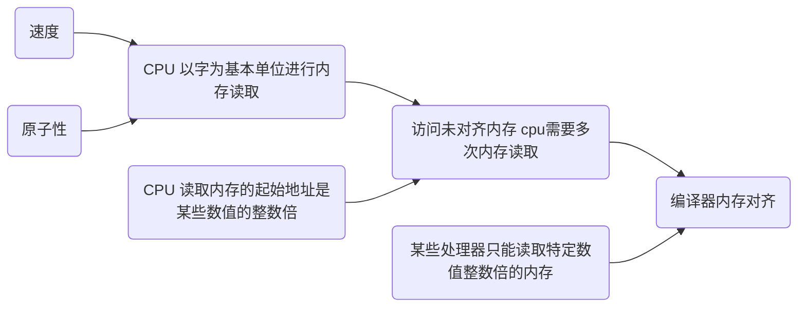

# 数据布局与内存对齐

## 1 什么是内存对齐

内存对齐和数据在内存中的位置有关。内存对齐以字节为单位进行，一个变量的内存地址如果正好等于它的长度的整数倍，则称为自然对齐。比如在32位cpu下，一个`u32`的内存地址为`0x00000004` ，则属于自然对齐。内存空间按照字节进行划分，理论上可以从任意地址开始读取，实际上会要求读取数据的首地址时某一个值的整数倍。一些系统内存对齐要求较为严格，例如sparc, 如果取未对齐的数据会报错，在x86 cpu上不会报错，效率会下降。

## 2. 为什么要对齐

尽管内存以字节为单位，现代处理器的内存子系统仅限于以字的大小的力度和对齐方式访问，处理器按照字节块的方式读取内存。一般按照`2, 4,8, 16` 字节为粒度进行内存读取。合理的内存对齐可以高效的利用硬件性能。

以4字节存取粒度的处理器为例，读取一个int变量（32bit 系统）, 处理器只能从4的倍数的地址开始。假如没有内存对齐机制，将一个int放在地址为1的位置。现在读取该int时，需要两次内存访问。第一次从0地址读取，剔除首个字节，第二次从4地址读取，只取首个字节；最后两下的两块数据合并入寄存器，需要大量工作。


有了严格的内存对齐，int必须按照对其规则进行存储，起始位置必须是4的整数倍，只需要进行一次读取即可。


### 2.1 编译器进行内存对齐的原因

+ **平台原因（兼容性）**： 某些处理器只能某些地址取特定类型的数据，否则抛出硬件异常。
+ **性能原因**： 数据结构（尤其栈内数据）应该尽可能在自然边界对齐。原因在于，为了访问未对齐内存，处理器需要做两次内存访问。对齐只需一次。

### 2.1 为什么以字大小的粒度进行内存访问？

+ **速度**

  当代处理器具有多个级别的高速缓存，数据必须通过这些高速缓存；支持单字节读取将使内存子系统的吞吐量与执行单元的吞吐量紧密的绑定（也就是cpu吞吐量），消耗大量cpu资源的的同时，称为系统性能的瓶颈。可以类比在硬盘读写中DMA(Direct Memory Access)性能是如何超越PIO（Programmed Input/Output）的。

  cpu 总是以其字的大小进行内存读取，进行未对齐的内存访问时，处理器将读取多个字，需要读取变量所跨越内存的所有字，同时进行处理。将导致访问请求数据所需要的内存事务增加2倍。

  

+ **原子性**

  CPU 可以在一个对齐的内存字上操作，意味着没有指令可以中断该操作。这对于许多**无锁数据结构**和其他**并发范式**的正确性至关重要。

## 3. c 语言内存对齐规则

每个平台有默认的对齐系数（也叫对齐模数）。gcc默认的`#pragma pack(4)` 以4字节进行对齐，可以通过预编译命令更改。

**有效对其值**： 系统给定的对齐系数，与结构体内最长数据长度较小的那一个。有效对其值也叫做**对齐单位**。

内存对齐的原则：

+ 结构体的第一个字段的偏移量（**offset**）为0以后每一个成员相对于结构体首字段的offset都是**该成员大小与有效对其值中较小的那个的整数倍**，不满足条件，自动填补字节。
+ **结构体的总的大小**时有效对齐值的整数倍，不满足将自动填充。

```C
typedef struct x1 {                                                                                                                                                                            
    int i;                                                                                                                                                                                     
    char c1;                                                                                                                                                                                   
    char c2;                                                                                                                                                                                   
}x1;                                                                                                                                                                                                                                                                                                                                                                               
typedef struct x2 {                                                                                                                                                                            
    char c1;                                                                                                                    
    int i;                                                                                                                          
    char c2;                                                                                                                                                        
}x2;                                                                                                                                                                                                                                                                                                                                                                                    
typedef struct x3 {                                                                                                                                                                            
    char c1;                                                                                                                                                                                   
    char c2;
    int i;
}x3;

```

以`x1`为例，对齐单位为4，`int` 从0地址开始，`c1` 大小取对齐单位与`char`类型较小值，从5开始，`c2` 从6开始。为满足规则，补上两个字节，占用8个字节.

`x2`结构体，`c1`地址0，`i` 需要满足规则1, 从地址4开始，`c2`从8开始，为满足规则2, 补上两个字节，占用12字节。




## 4. Rust 内存对齐

### 4.1 结构体

Rust 对齐规则与C类似，但是在Rust 1.18 之后进行内存布局的优化，通过重新排列字段顺序，减小所需的内存空间。由大神[Austin Hicks](https://github.com/ahicks92) 在2017年完成，具体记录[可见](https://camlorn.net/posts/April%202017/rust-struct-field-reordering/) .

Rust 中结构体的对齐单位是所有字段中最长的一个，需要注意的是，在64为系统下`i128`, `u128` 对齐单位为`8`, 32位系统中，`u64`, `f64` 对齐单位为`4`。

```Rust
struct Foo<T, U> {
    count: u16,
    data1: T,
    data2: U,
}

Foo::<u16, u32>, Foo::<u32, u16> 
```

以上列子通过编译器优化，在对齐单位为4的结构体中，大小始终为8.

### 4.2 repr(u), repr(i)

可以使用这两个注解，指定无成员枚举值所占空间的大小, 可选值`u8, u16, u32, u64, usize, i8, i16, i32, i64, i128, isize`

```Rust
enum Enum {
    Variant0(u8),
    Variant1,
}

#[repr(C)]
enum EnumC {
    Variant0(u8),
    Variant1,
}

#[repr(u8)]
enum Enum8 {
    Variant0(u8),
    Variant1,
}

#[repr(u16)]
enum Enum16 {
    Variant0(u8),
    Variant1,
}

fn main() {
    assert_eq!(std::mem::size_of::<Enum>(), 2);
    // The size of the C representation is platform dependant
    assert_eq!(std::mem::size_of::<EnumC>(), 8);
    // One byte for the discriminant and one byte for the value in Enum8::Variant0
    assert_eq!(std::mem::size_of::<Enum8>(), 2);
    // Two bytes for the discriminant and one byte for the value in Enum16::Variant0
    // plus one byte of padding.
    assert_eq!(std::mem::size_of::<Enum16>(), 4);
}
```

### 4.3 repr(C)

repr(C) 目的很简单，就是为了内存布局和 C 保持一致。需要通过 FFI 交互的类型都应该有 repr(C)。而且如果我们要在数据布局方面玩一些花活的话，比如把数据重新解析成另一种类型，repr(C) 也是很有必要的。

### 4.4 repr(align(x)) repr(packed(x))

这两个修饰符可以分别提高或者降低`struct` ,`union` 的对齐单位, `packed` 可能改变字段间的填充.

对齐值x必须是2 的次幂，可选范围 1 ~ $2^{29}$， 对于`packed` 如果没有指定x,默认值是1。

对于`align`而言，如果指定的对齐单位小于默认对齐单位，则该修饰符不生效，依然使用较大的对齐单位。

同理，对于`packed`, 如果指定对齐单位大于默认对齐单位，则修饰符不生效。**为了定位字段，每一个字段的对齐单位是指定对齐单位与字段类型对齐单位的较小值。**  注意这两个修饰符不可以同时用于一个类型，`packed` 修饰符不可以传递性的包含另一个`align`修饰的类型。`align`, `packed` 只能应用于`default` , `C` repr.

`repr(packed)` 强制Rust不填充数据，各个数据类型紧密排列。有助于提高内存的使用率，但是可能导致其他副作用。尤其是大多数平台都强调内存对齐。这意味着加载未对齐的数据会很低效（x86）或者时错误的（一些ARM芯片）。**此修饰符不应该随便使用，仅适用于某些极端需求。**

### 4.5 透明表示

`transparent` 展示仅用于`struct`, `enum` ，而仅有一个变量，满足条件：

+ 仅有一个非零大小（Non-zero size）的字段
+ 或者任意数量的零大小的字段(Zero sized type; ZST)

使用该表示时struct内存布局以及ABI与单个非零大小的字段一致。这一点与`C`表示不同，使用`C`表示时会有`struct`的ABI。使用`transparent` 表示的结构体只有一个`u8`,则具有`u8`的ABI。

**由于此表示将类型布局委托给另一种类型，因此不可以与其他表示一起使用。**


