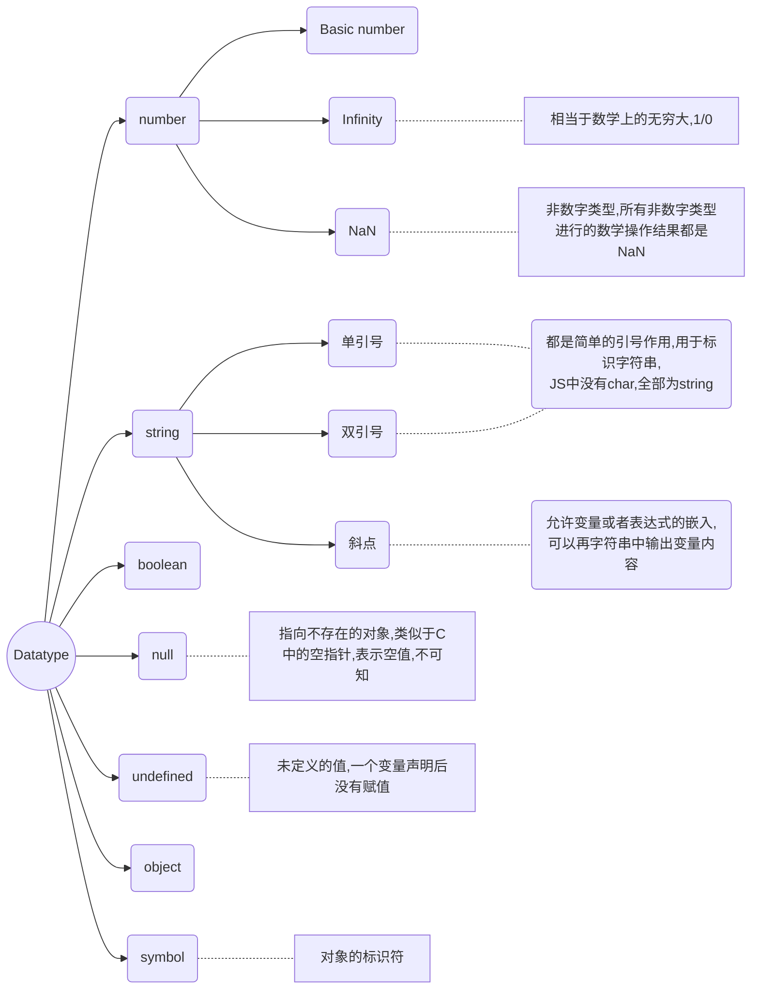

# JavaScript Bases

[TOC]

## 1. Introduction to JavaScript

JavaScript 最初被创造的意图是"make webapge alive", 最初也叫作"LiveScript" ,可以内嵌在HTML文档中并且被自动加载执行,也可以将js文件以script tag的形式嵌入式到html中进行交互操作.现在js不仅可以在浏览器中使用,也可以用在服务端或者是任何有JavaScript Engine 的设备中,在浏览器中的内嵌的js引擎,也被称为js虚拟机例如:chorme的V8引擎; firefox的spidermonkey

> 🐲 How do engines work?
>
> 1. 引擎读入脚本文件
> 2. 引擎将脚本编译为机器码
> 3. 执行机器码,具有较快的速度

### What can JS do?

现代的js是一门安全的编程语言,不提供对于内存和cpu的直接访问,语言的处理能力很大程度上取决于其执行环境,例如`node.js` 支持函数可以直接读写二进制文件,进行网络请求等...

而网页内嵌的JS支持所有网页维护以及用户交互的内容:

- 添加新的html到该页中,更改现存的内容,更改样式
- 对于用户操作做出反应,响应鼠标事件,指针移动,按键动作等等
- 对于原单服务器发送请求,下载或者上传文件(AJAX COMET)
- 获取设置cookies,客户端记住信息

### What can't In-browser JS do?

浏览器内嵌的JS为了保证用户安全,防止恶意网页获取用户的私有信息或者损害用户数据,所以不可以进行以下类似操作:

- 可能无法读取或者执行磁盘的二进制文件,没有可以直接获取操作系统资源的函数;现代浏览器允许进行文件操作,可以调用摄像头或者麦克风但是需要获取用户的明确权限

- 不同的窗口和TAB间不共享信息,有时会有一定程度的共享,例如一个窗口打开另一个网页窗口;但即使在这种情况下,如果两个窗口不是来自同一个站点(不同的domin, protocol, port),也不可以进行信息共享.

  这是一个为了用户安全的考虑,一个从百度打开的网页永远无法获取你的google账号信息

- JS可以与当前网页域名服务器的进行数据传输,但是不可以与其他站点进行数据传输

这些限制在非浏览器JS上不存在的

### What is the unique?

- 与html/css的完全集成
- 简单的事情简单做
- 支持所有主流浏览器,而且默认是启用的

### Languages "over" JS

可能js的语法体系不适合于每一个开发者的需求,有些开发语言对于js语法进行特定的改变,在浏览器上执行前被转化为JS代码

- **CoffeeScript:** JS的一个语法糖,提供了更为简洁的语法,具有简洁清晰的代码格式
- **TypeScript:** 注重于严格的数据类型,简化对于复杂系统的开发与支持
- **Dart:** 具有独立引擎的语言,google开发用于期待JS的语言,但是现在需要转化为JS语言后才能在浏览器上使用

## 2. JS HTML CSS

三者各自承担不同的任务:

- **HTML**: 用于进行内容组织
- **Cascading Style Sheets**: 用于视觉效果
- **JavaScript**: 用做用户交互逻辑

## 3. In-browser  JS

### 1. 嵌入到html

```html
<script>
    alert("...")
    let result = prompt("How old are u?");
    alert(`UR age is ${result}`);
</script>>

<!--以文件的形式嵌入到html, 默认的脚本类型是JS所以不需要指明类型-->
<script type='text/javascrpt' src="/path/to/js_file"></script>
```

这里给出的脚本文件路径是一个绝对路径,也可以给出一个url,当脚本tag给出源文件时,标签内部的代码直接被忽略,不会被执行

## 4."use strict" 现代模式

JavaScript的发展很长时间都是向语言中加入新的特征但是不更改原有的特征,从而使原有代码可以顺利运行,但是坏处是js初始版本的不完美的部分以及错误会一直给js的发展带来障碍.这种状况直到2009年的ECMAScript5( ES5) ,添加了一些新的特征并且修改了原有的部分.现代的JS代码一般都需要采用严格模式,只需要在文件头添加字符串 "use strict"

通过严格模式,在函数内部选择较为严格的全局或者局部错误模式,可以及时捕获一些可能导致错误的编程行为

## 5. 基础语法

### 声名变量

声名变量可以使用let ,var(old-fashion) ,变量名命名与java类似,不可以以数字开头,不可以使用`-` 符号在变量名中,常量用const关键字,一般变量名为大写

```javascript
"use strict"
let var1 = 'It\'s a string';
let var2 = 'Another string';
const COLOR_RED = '#F00';
var var3 = [222, 23];
```

### 数据类型



可以使用typeof运算符获取一个值的类型,也可以使用`typeof()` 函数

```javascript
let test; typeof test; // undefined
typeof Symbol("id");    //symbol
typeof Math; // object
typeof null;  //null
typeof alert;  //function
```

### 基础类型转化

通常情况下,操作符或者函数会自动将数值转换为相应类型,使用`console.log` 函数时会自动将所有参数转换为string类型,对于基本类型的转换如下:

- **ToString:**

  可以显式调用String()函数,进行类型转换

- **ToNumber:** 

  向数字类型的转换发生在算术运算以及函数中,也可以调用`Number()`函数进行显式转换,无法装换位数字类型的是`NaN` 

  | Value      | Becomes..                                                    |
  | ---------- | ------------------------------------------------------------ |
  | undefined  | NaN                                                          |
  | null       | 0                                                            |
  | true false | 1 0                                                          |
  | string     | 字符串开头结尾的空格被删去,剩下的如果为空字符串,则为0;不为空则从字符串中读取相应的数值,不可以转化的为`NaN` |

  对于所有的算术运算,除了+ ,.均会转换为数字类型,对于`+` 如果一个值为string,无论string在前或者在后,均会将其转换为string类型

  ```javascript
  1+'2' --> '12'
  '1' + 2 --> '12'
  ```

  使用`parseInt()` 函数可以从第一个数字开始进行逐位转化，到最后一个非数字终止

  `parseFloat()` 进行浮点数的转化，如果字符串中包含不可以转换位浮点数的字符，则直接返回

  `isNaN` 方法可以用来判断一个值是否为NaN

- **ToBoolean:** 

  - 数值默认初始为"empty" 即0, null, undefined, NaN, '' 全为false
  - 其他值均为true

  🌩**字符串"0"为true:**

  根据规定,只有空字符串转换为False,所以对于"0" '  '均为true 

```javascript
console.log("6"/"2")  //3
undefines + 1 // NaN
"" + 1 + 0  // "10"
"" - 2 + 0   //-2
"%" + 2+ 3   // '%23'
1 + 23 +'px'  // 24px
12/0 --> Infinity

//进行类型转化是对于+需要更加注意,只要有字符串就会转化为字符串类型
"-1\n" + 12 --> "-1\n12"
"12\n   " - 1 --> 11  //去掉所有的前后空白进行算数转换
null + 1 --> 1

```

### 操作符

- string连接,双操作符:`+` 

  任意一个操作数为string结果即为string,注意双操作符的作用域仅涉及两个操作数,对于其他的操作数不起任何作用例如:`1+2+'%'--> '3%'` 

- 数字类型的转化,使用单操作符:`+` 

  ```javascript
  let x = 1;
  +x //对数字不起作用
  x = true;
  +x --> 1
  +"" --> 0
  ```

  可以看做是Number()函数的缩短版本,所以需要将string转化为number可以直接使用`+` 操作符

  `let a = '1', b = '12'; +a + +b --> 13`

- 优先级

  累加运算符优先级高于 * /;每个单运算符优先级均高于对应的双运算符,;赋值运算符的优先级较低

  赋值运算符也会得到一个结果,将所赋的值返回

- 前缀递增/后缀递增

  前缀递增先计算后赋值,后缀递增先赋值后计算

- 位运算符:

  - AND ( `&` )
  - OR ( `|` )
  - XOR ( `^` )
  - NOT ( `~` )
  - LEFT SHIFT ( `<<` )
  - RIGHT SHIFT ( `>>` )
  - ZERO-FILL RIGHT SHIFT ( `>>>` )

- 逗号`,`

  逗号运算符具有最低的优先级,一般用于表示运算的过程,最终只返回最后一个值

  `a = (1+2, 3+2);  a-->5` 

### 数值比较

进行比较时,关于相等有两种方式,一种是严格模式`===` ,一种是非严格模式`==` ,非严格模式伴随着类型的自动转换;对于其他类型的比较,也会进行类型转换

在js内部所有的数字都是以64位浮点数进行存储的，即使整数也是如此，在js底层中并没有整数，所有数字都是小数，所以设计小数运算需要特别小心

```javascript
// true
'2' > 1
0 == '0'
0 == false
'0' == true 

'' == false
null== false
null == undefine

//false
0 === false
'' === 0
null === undefined //对于使用算数比较符,null --> 0 undefined --> NaN
null > 0
null == 0
```

对于字符串的比较,按照字典序逐字符比较,按照第一个字符最大的字符串最大进行表示,实际上是按照unicode进行标志

对于特殊类型`null undefined` 是"sweet couple" ,使用非严格检查二者是相等的,但是严格检查不等,对于null和0的比较

```javascript
null > 0 //false
null>=0  null<=0 //true

//相等检查和大小检查具有不同的运作机制,大小检查将null转化为0,但是相等检查不进行转化
//对于undefined类型不可以进行比较,任何比较均为false,因为其数值转化为NaN,而NaN是一个特殊的数据类型,随其进行任何算数比较,结果均为false
```

### 数值表示

根据国际标准 IEEE 754 ，js 的浮点数64 个二进制位，组成如下：

- 第一位： 符号位 0 为正，1为负
- 2~12： 指数部分
- 13~63：小数部分

对于数值的表示，使用科学计数法例如`123e3  -3.11e+12` ,杜宇以下情况js会自动将数值转化为科学计数法表示

- 小数点前数字多于21位
- 小数点后0多于5个

进制表示：

- 八进制：`0o` 或者`0O` 前缀的数字
- 十六进制： `0x  0X` 前缀数字
- 二进制： `0b   0B` 前缀数字

## 6.Js in browser function

```javascript
alert(...)   
      显示提示
result = prompt(title, [, default]);
      文本输入框,可以设置默认值
result = confirm(question);
      问题框,ok/cancel
```

## 7.三元操作符以及多元操作符

```javascript
let allowed = age > 18? true : false;
let message = (age < 3)? 'Hi, baby' :
    (age<18) ? 'Hello!' :
    (age<100) ? 'Greeting!' : 'What an amazing age';
```

有时?常用作if关键字的一个替代品

## 8. 函数表达式以及arrows函数

### 函数声明的提升

js引擎将函数名视为变量,使用`function` 关键字声明函数会将函数名的作用域提升到该block的头部,所以在改代码块内可以在任何地方使用该函数,但是使用函数表达式不可以

```javascript
f();
function f() {}

// 使用函数表达式时的等价替换
f();
var f = function () {}
//============等价===============
var f;
f();
f = () => {};
```

如果同时采用函数声明以及赋值语句声明同一个函数,那么最终调用的一定是采用函数表达式的方式定义的函数

```javascript
let f = () => {
  console.log(1);  
};
function f() {
    console.log(2);
}
f();
//  1
```


**函数表达式**

在js中将函数作为一种特殊的值，可以将任意函数赋值给一个变量，一般使用`function` 关键字来定义函数体，可以直接定义函数名，也可以将一个函数赋给另一个变量

```javascript
function sqyHi(){
    // pass
}
let sqyHi = function (){
    // pass
};
let test = sayHi;
test();
```

在浏览器内置js中可以使用`alert（sayHi）`函数来查看函数源代码，这种调用不会执行该函数，因为后面没有跟参数；与其它编程语言不同，在js中将函数当做一个值，使用`alert` 只会展示其字符值

**函数表达式与函数声明的区别：**

函数表达式本质上是将一个值赋给一个变量，是在运行时创建并在之后才可以使用的，在函数表达式创建之前，不可以调用该函数；而函数声明的作用域是整个脚本，在程序执行前该函数已经被创建，可以在声明之前使用该函数

**arrow function**：

可以使用另外一种简洁的语法来实现函数表达式使用`=>` 指明所需要的表达式

```javascript
let fun = (arg1, arg2, arg3, ...) => expression
```

```javascript
let sun = (a, b) => a + b;
let times = (a, b) => a ** b;
times(3 ,4);

let age = prompt("What is your age?", 18);

let welcome = (age < 18) ?
  () => alert('Hello') :
  () => alert("Greetings!");

welcome();
```

### 参数的问题

- 参数省略

  在js中函数参数不是必须的,允许省略参数,对于一个具体函数来说,`length` 属性仅说明了根据声明预期传入的参数的数目,并不是运行时实际传入的参数的数量,允许省略参数

  ```javascript
  function f(q, v) {
      return q;
  }
  f(1, 2, 3) // 1
  f(1) // 1
  f() // undefined
  
  f.length // 2
  ```

  上面代码的函数`f`定义了两个参数，但是运行时无论提供多少个参数（或者不提供参数），JavaScript 都不会报错。省略的参数的值就变为`undefined`。需要注意的是，函数的`length`属性与实际传入的参数个数无关，只反映函数预期传入的参数个数。

  但是，没有办法只省略靠前的参数，而保留靠后的参数。如果一定要省略靠前的参数，只有显式传入`undefined`。

  ```javascript
  function f(a, b) {
    return a;
  }
  
  f( , 1) // SyntaxError: Unexpected token ,(…)
  f(undefined, 1) // undefined
  ```

  上面代码中，如果省略第一个参数，就会报错。 

- 传递方式

  - 按值传递: 参数为原始类型(数值,字符串,boolean),在函数内修改参数值,不会影响到函数外的变量
  - 传址传递: 传入的是符合类型的对象,在函数内修改参数会影响到外部变量

  注意，如果函数内部修改的，不是参数对象的某个属性，而是替换掉整个参数，这时不会影响到原始值。

  ```javascript
  var obj = [1, 2, 3];
  
  function f(o) {
    o = [2, 3, 4];
  }
  f(obj);
  
  obj // [1, 2, 3]
  ```

  上面代码中，在函数`f`内部，参数对象`obj`被整个替换成另一个值。这时不会影响到原始值。这是因为，形式参数（`o`）的值实际是参数`obj`的地址，重新对`o`赋值导致`o`指向另一个地址，保存在原地址上的值当然不受影响。

- **同名参数**

  如果存在同名参数,则取后出现的那个值,对于同名参数,如果需要取用第一个参数的值,可以使用`argument` 对象进行操作

  ```javascript
  function f(a, a) {
      console.log(a);
  }
  f(1, 2); // 2
  
  function f(a, a) {
    console.log(arguments[0]);
  }
  
  f(1) // 1
  ```

- **`arguments` 对象**

  由于 JavaScript 允许函数有不定数目的参数，所以需要一种机制，可以在函数体内部读取所有参数。这就是`arguments`对象的由来。

  `arguments`对象包含了函数运行时的所有参数，`arguments[0]`就是第一个参数，`arguments[1]`就是第二个参数，以此类推。这个对象只有在函数体内部，才可以使用。

  ```javascript
  var f = function (one) {
    console.log(arguments[0]);
    console.log(arguments[1]);
    console.log(arguments[2]);
  }
  
  f(1, 2, 3)
  // 1
  // 2
  // 3
  ```

  正常模式下，`arguments`对象可以在运行时修改。但是基于严格模式的代码不可以进行更改,因为在是只读模式,使用函数名`.length` 得到的只是声明中的参数列表长度,可以使用arguments对象得到实际的可变参数列表

  **`arguments`  与数组的关系** :

  需要注意的是，虽然`arguments`很像数组，但它是一个对象。数组专有的方法（比如`slice`和`forEach`），不能在`arguments`对象上直接使用。

  如果要让`arguments`对象使用数组方法，真正的解决方法是将`arguments`转为真正的数组。下面是两种常用的转换方法：`slice`方法和逐一填入新数组。

  ```javascript
  var args = Array.prototype.slice.call(arguments);
  
  // 或者
  var args = [];
  for (var i = 0; i < arguments.length; i++) {
    args.push(arguments[i]);
  } 
  ```

- 立即调用表达式(IIFE)

  在js中()是一个运算符,跟在函数名之后,表示调用函数,但是如果需要在定义时即可调用某个函数,不可以直接在`function()(\**\)` 后加括号,会产生语法错误.因为`function` 关键字既可以作为语句,也可以作为表达式

  为了避免上述语法歧义,js规定如果`function` 关键字出现在行首,一律解释称语句,为了让引擎将其理解为一个表达式,可以在关键字以及定义上加括号,将其放在圆括号里

  ```javascript
  (function(){ /* code */ }());
  // 或者
  (function(){ /* code */ })();
  // 所以只需要使得 function 关键字不处于行首即可
  var i = function(){ return 10; }();
  true && function(){ /* code */ }();
  0, function(){ /* code */ }();
  
  !function () { /* code */ }();
  ~function () { /* code */ }();
  -function () { /* code */ }();
  +function () { /* code */ }();
  ```

  **通常情况下只对于匿名函数使用这种方式,可以避免污染全局变量,同事IIFE内部形成了一个单独的作用域,可以封装一些外部无法读取的私有变量**

## 9. 代码风格

- 使用java式大括号风格，行前两空格，参数列表紧跟函数名，参数间采用python风格， 大括号与小括号之间需要有空格
- 所有操作符左右都需要有空格，对于简答判断语句，只需要执行一步操作时也需要使用大括号将其括起来，避免逻辑错误siyoubianliang

## 10. 注释

使用注释时，一个好的注释需要描述架构，指明函数用途，列举参数以及返回值，需要有整体架构的意识，函数用途，重要的算法，尤其是不太明显的

```javascript
/**
 * Returns x raised to the n-th power.
 *
 * @param {number} x The number to raise.
 * @param {number} n The power, must be a natural number.
 * @return {number} x raised to the n-th power.
 */
function pow(x, n) {
  ...
}
```

