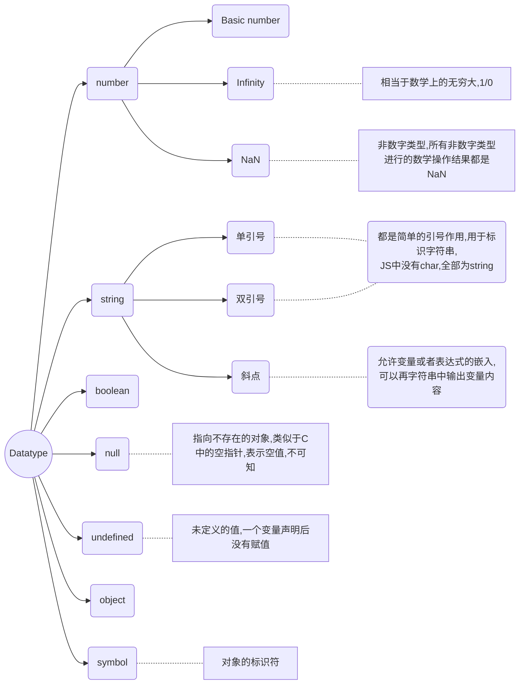

#JavaScript Bases

[TOC]

## 1. Introduction to JavaScript 

JavaScript 最初被创造的意图是"make webapge alive", 最初也叫作"LiveScript" ,可以内嵌在HTML文档中并且被自动加载执行,也可以将js文件以script tag的形式嵌入式到html中进行交互操作.现在js不仅可以在浏览器中使用,也可以用在服务端或者是任何有JavaScript Engine 的设备中,在浏览器中的内嵌的js引擎,也被称为js虚拟机例如:chorme的V8引擎; firefox的spidermonkey

> :dragon_face: How do engines work?
>
> 1. 引擎读入脚本文件
> 2. 引擎将脚本编译为机器码
> 3. 执行机器码,具有较快的速度

###What can JS do?

现代的js是一门安全的编程语言,不提供对于内存和cpu的直接访问,语言的处理能力很大程度上取决于其执行环境,例如`node.js` 支持函数可以直接读写二进制文件,进行网络请求等...

而网页内嵌的JS支持所有网页维护以及用户交互的内容:

+ 添加新的html到该页中,更改现存的内容,更改样式
+ 对于用户操作做出反应,响应鼠标事件,指针移动,按键动作等等
+ 对于原单服务器发送请求,下载或者上传文件(AJAX COMET)
+ 获取设置cookies,客户端记住信息

### What can't In-browser JS do?

浏览器内嵌的JS为了保证用户安全,防止恶意网页获取用户的私有信息或者损害用户数据,所以不可以进行以下类似操作:

+ 可能无法读取或者执行磁盘的二进制文件,没有可以直接获取操作系统资源的函数;现代浏览器允许进行文件操作,可以调用摄像头或者麦克风但是需要获取用户的明确权限

+ 不同的窗口和TAB间不共享信息,有时会有一定程度的共享,例如一个窗口打开另一个网页窗口;但即使在这种情况下,如果两个窗口不是来自同一个站点(不同的domin, protocol, port),也不可以进行信息共享.

  这是一个为了用户安全的考虑,一个从百度打开的网页永远无法获取你的google账号信息

+ JS可以与当前网页域名服务器的进行数据传输,但是不可以与其他站点进行数据传输

这些限制在非浏览器JS上不存在的

### What is the unique?

+ 与html/css的完全集成
+ 简单的事情简单做
+ 支持所有主流浏览器,而且默认是启用的

### Languages "over" JS

可能js的语法体系不适合于每一个开发者的需求,有些开发语言对于js语法进行特定的改变,在浏览器上执行前被转化为JS代码

+ **CoffeeScript:** JS的一个语法糖,提供了更为简洁的语法,具有简洁清晰的代码格式
+ **TypeScript:** 注重于严格的数据类型,简化对于复杂系统的开发与支持
+ **Dart:** 具有独立引擎的语言,google开发用于期待JS的语言,但是现在需要转化为JS语言后才能在浏览器上使用

## 2. JS HTML CSS

三者各自承担不同的任务:

+ **HTML**: 用于进行内容组织
+ **Cascading Style Sheets**: 用于视觉效果
+ **JavaScript**: 用做用户交互逻辑

## 3. In-browser  JS

### 1. 嵌入到html

```html
<script>
    alert("...")
    let result = prompt("How old are u?");
    alert(`UR age is ${result}`);
</script>>

<!--以文件的形式嵌入到html, 默认的脚本类型是JS所以不需要指明类型-->
<script type='text/javascrpt' src="/path/to/js_file"></script>
```

这里给出的脚本文件路径是一个绝对路径,也可以给出一个url,当脚本tag给出源文件时,标签内部的代码直接被忽略,不会被执行

## 4."use strict" 现代模式

JavaScript的发展很长时间都是向语言中加入新的特征但是不更改原有的特征,从而使原有代码可以顺利运行,但是坏处是js初始版本的不完美的部分以及错误会一直给js的发展带来障碍.这种状况直到2009年的ECMAScript5( ES5) ,添加了一些新的特征并且修改了原有的部分.现代的JS代码一般都需要采用严格模式,只需要在文件头添加字符串 "use strict"

通过严格模式,在函数内部选择较为严格的全局或者局部错误模式,可以及时捕获一些可能导致错误的编程行为

## 5. 基础语法

###声名变量

声名变量可以使用let ,var(old-fashion) ,变量名命名与java类似,不可以以数字开头,不可以使用`-` 符号在变量名中,常量用const关键字,一般变量名为大写

```javascript
"use strict"
let var1 = 'It\'s a string';
let var2 = 'Another string';
const COLOR_RED = '#F00';
var var3 = [222, 23];
```

### 数据类型



可以使用typeof运算符获取一个值的了;类型,也可以使用`typeof()` 函数

```javascript
let test; typeof test; // undefined
typeof Symbol("id);    //symbol
typeof Math; // object
typeof null;  //null
typeof alert;  //function
```

### 基础类型转化

通常情况下,操作符或者函数会自动将数值转换为相应类型,使用`console.log` 函数时会自动将所有参数转换为string类型,对于基本类型的转换如下:

+ **ToString:**

  可以显示调用String()函数,进行类型转换

+ **ToNumber:** 

  向数字类型的转换发生在算术运算以及函数中,也可以调用`Number()`函数进行显式转换,无法装换位数字类型的是`NaN` 

  | Value      | Becomes..                                                    |
  | ---------- | ------------------------------------------------------------ |
  | undefined  | NaN                                                          |
  | null       | 0                                                            |
  | true false | 1 0                                                          |
  | string     | 字符串开头结尾的空格被删去,剩下的如果为空字符串,职位0;不为空则从字符串中读取相应的数值,不可以转化的为`NaN` |

  对于所有的算术运算,除了+ ,.均会转换为数字类型,对于`+` 如果一个值为string,无论string在前或者在后,均会将其转换为string类型

  ```javascript
  1+'2' --> '12'
  '1' + 2 --> '12'
  ```

+ **ToBoolean:** 

  * 数值默认初始为"empty" 即0, null, undefined, NaN, '' 全为false
  * 其他值均为true

  :cloud_with_lightning:**字符串"0"为true:**

  根据规定,只有空字符串转换为False,所以对于"0" '  '均为true 

```javascript
console.log("6"/"2")  //3
undefines + 1 // NaN
"" + 1 + 0  // "10"
"" - 2 + 0   //-2
"%" + 2+ 3   // '%23'
1 + 23 +'px'  // 24px
12/0 --> Infinity

//进行类型转化是对于+需要更加注意,只要有字符串就会转化为字符串类型
"-1\n" + 12 --> "-1\n12"
"12\n   " - 1 --> 11  //去掉所有的前后空白进行算数转换
null + 1 --> 1

```

### 操作符

+ string连接,双操作符:`+` 

  任意一个操作数为string结果即为string,注意双操作符的作用域仅涉及两个操作数,对于其他的操作数不起任何作用例如:`1+2+'%'--> '3%'` 

+ 数字类型的转化,使用单操作符:`+` 

  ```javascript
  let x = 1;
  +x //对数字不起作用
  x = true;
  +x --> 1
  +"" --> 0
  ```

  可以看做是Number()函数的缩短版本,所以需要将string转化为number可以直接使用`+` 操作符

  `let a = '1', b = '12'; +a + +b --> 13`

+ 优先级

  累加运算符优先级高于 * /;每个单运算符优先级均高于对应的双运算符,;赋值运算符的优先级较低

  赋值运算符也会得到一个结果,将所赋的值返回

+ 前缀递增/后缀递增

  前缀递增先计算后赋值,后缀递增先赋值后计算

+  位运算符:

   - AND ( `&` )
   - OR ( `|` )
   - XOR ( `^` )
   - NOT ( `~` )
   - LEFT SHIFT ( `<<` )
   - RIGHT SHIFT ( `>>` )
   - ZERO-FILL RIGHT SHIFT ( `>>>` )

+  逗号`,`

   逗号运算符具有最低的优先级,一般用于表示运算的过程,最终只返回最后一个值

   `a = (1+2, 3+2);  a-->5` 

### 数值比较

进行比较时,关于相等有两种方式,一种是严格模式`===` ,一种是非严格模式`==` ,非严格模式伴随着类型的自动转换;对于其他类型的比较,也会进行类型转换

```javascript
// true
'2' > 1
0 == '0'
0 == false
'0' == true 

'' == false
null== false
null == undefine

//false
0 === false
'' === 0
null === undefined //对于使用算数比较符,null --> 0 undefined --> NaN
null > 0
null == 0
```

对于字符串的比较,按照字典序逐字符比较,按照第一个字符最大的字符串最大进行表示,实际上是按照unicode进行标志

对于特殊类型`null undefined` 是"sweet couple" ,使用非严格检查二者是相等的,但是严格检查不等,对于null和0的比较

```javascript
null > 0 //false
null>=0  null<=0 //true

//相等检查和大小检查具有不同的运作机制,大小检查将null转化为0,但是相等检查不进行转化
//对于undefined类型不可以进行比较,任何比较均为false,因为其数值转化为NaN,而NaN是一个特殊的数据类型,随其进行任何算数比较,结果均为false
```

## 6.Js in browser function

```javascript
alert(...)   
      显示提示
result = prompt(title, [, default]);
      文本输入框,可以设置默认值
result = confirm(question);
      问题框,ok/cancel
```

## 7.三元操作符以及多元操作符

```javascript
let allowed = age > 18? true : false;
let message = (age < 3)? 'Hi, baby' :
    (age<18) ? 'Hello!' :
    (age<100) ? 'Greeting!' : 'What an amazing age';
```

有时?常用作if关键字的一个替代品